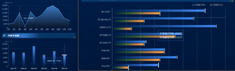

# echarts-tooltip-loop


echarts-tooltip-loop

echarts图表提示框自动循环

## Install

```node
npm install echarts-tooltip-loop --save
```


## params

| 参数名              | 类型     | 默认值 | 描述  |
| ------------------ | -------- | ------- | ------------ |
| interval           | number   | 2000 | 轮播时间间隔，单位毫秒                                                                               |
| loopSeries         | boolean  | true    | true表示循环所有series的tooltip，false则显示指定seriesIndex的tooltip                                 |
| seriesIndex        | number   | 0       | 指定某个系列（option中的series索引）循环显示tooltip，当loopSeries为true时，从seriesIndex系列开始执行 |
| updateData         | function | -       | 当轮播到第一个数据项时，会调用此回调函数                                                             |
| reverseDirection   | boolean  | false   | true表示反方向显示tooltip                                                                            |
| initialDelay       | number   | 2000    | 第一个tooltip出现的延迟时间，单位毫秒                                                                |

## Usage

```html
<div class="charts" ref="charts"></div>
```

```js

// demo 
import * as echarts from 'echarts'
import { looping } from '@/utils/echarts-tooltip-loop.js'

// your code if vue3
let charts = ref()
let myChart = echarts.init(charts.value)
const myChartOption = {}
myChart.setOption(myChartOption)

//use tooltipLoop
let params = {}
looping(myChart, myChartOption, params)

//or need clearLoop
const loopController = looping(myChart, myChartOption, params)
loopController.clearLoop();

```

## credits
[echarts-tooltip-loop](https://github.com/carsum/echarts-tooltip-loop)


